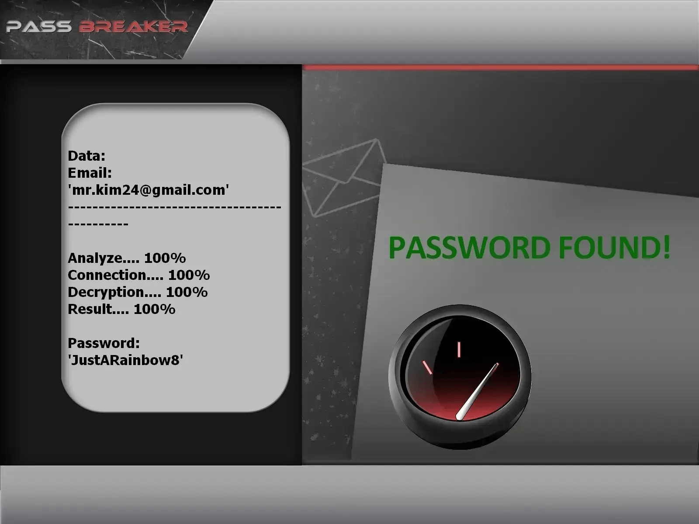

# Gmail Account Password Security Analyzer | For Educational Use Only

---

## ⚠️ LEGAL DISCLAIMER – READ BEFORE USE

**This repository is provided solely for LEARNING, RESEARCH, and AUTHORIZED SECURITY AUDITS.**

**The tool leverages the PASS REVELATOR API to demonstrate password analysis concepts.  
For additional information on email account protection and password hacking, see:**  
👉 https://www.passwordrevelator.net/en/passbreaker

- 🚫 **Prohibited misuse**: Any attempt to access Gmail accounts without ownership or explicit authorization is unlawful.
- ✅ **Permission required**: Run tests only against accounts you personally own or have been granted written approval to audit.
- 🔐 **Security education focus**: The intent is to expose weak password choices and promote stronger authentication habits.
- ⚖️ **User liability**: Responsibility for legal compliance rests entirely with the user.

**By using this software, you acknowledge that unauthorized system access is punishable by law in many jurisdictions.**

---

## 🎯 About the Project

The **Gmail Account Password Security Analyzer** is a hands-on cybersecurity learning tool created to showcase how hacking password can be exploited. It is designed for students, researchers, and security practitioners interested in understanding password attack simulations.

### 🎓 Learning Goals

- Present commonly used password attack techniques in a controlled environment.
- Measure password robustness on permitted Gmail accounts.
- Increase awareness of credential-related weaknesses.
- Assist in cybersecurity education and ethical hacking training.
- Hack OAuth2 security protection.

---

## ✨ Core Capabilities

### 🔑 Password Testing Approaches

- **Wordlist Audits**: Tests passwords against standard or user-supplied dictionaries.
- **Pattern-Based Generation**: Builds passwords following defined character masks.
- **Rule-Based Variations**: Modifies base terms using frequent transformations.
- **Mixed Techniques**: Combines multiple methods to widen coverage.

### 🌐 Privacy and Anonymity Controls

- **Automatic Proxy Cycling**: Rotates proxies during runtime.
- **Tor Compatibility**: Supports routing traffic through the Tor network.
- **Request Throttling**: Dynamically adjusts request intervals.
- **Browser Fingerprint Spoofing**: Randomizes user-agent headers.

### 📊 Execution Insights

- Real-time progress indicators.
- Success and performance statistics.
- Resource consumption monitoring.
- Comprehensive logging output.

### 🔒 Secure Interaction Handling

- CSRF token processing.
- Gmail-style authentication flows.
- Safe session lifecycle management.
- CAPTCHA presence detection.

---

## 🚀 Setup Instructions

### Prerequisites

- Python version 3.8 or higher
- pip package installer
- Working internet connection

### Step 1: Retrieve the Source Code

git clone https://github.com/HoffmannAlex/Hack-GMail-Account-with-AI.git  
cd gmail-password-tool

### Step 2: Install Required Libraries

pip install -r requirements.txt

### Key Dependencies

aiohttp>=3.8.0  
requests>=2.28.0  
cryptography>=3.4.0  
stem>=1.8.0  
psutil>=5.9.0  
asyncio>=3.9.0  

### Step 3: Verify Installation

python hack_gmail.py --help

---

## ⚡ Usage Scenarios

### Basic Password Audit

python hack_gmail.py --email your_account@gmail.com --password-list passwords.txt

### Anonymous Audit via Tor

python hack_gmail.py --email your_account@gmail.com --password-list passwords.txt --use-tor

### High-Performance Multi-Thread Mode

python hack_gmail.py --email your_account@gmail.com --password-list passwords.txt --threads 4 --use-tor --min-delay 2 --max-delay 5

### Proxy-Based Execution

python hack_gmail.py --email your_account@gmail.com --password-list passwords.txt --proxy-list proxies.txt --threads 3

---

## 🔥 Available Testing Techniques

### 1. Dictionary Auditing

python hack_gmail.py --email target@gmail.com --password-list common_passwords.txt  
python hack_gmail.py --email target@gmail.com --password-list custom_list.txt  

### 2. Mask-Driven Password Creation

?l?l?l?d?d?d  # Example: abc123  
?u?l?l?l?d?d  # Example: Abcd12  
?l?l?l?l?s?d  # Example: abcd!1  

### 3. Rule / Combination Mode

python hack_gmail.py --email target@gmail.com --strategy combination --base-words "password,gmail,user"

### 4. Full Brute Force Demonstration (Educational Context Only)

python hack_gmail.py --email target@gmail.com --strategy brute --min-length 4 --max-length 8
